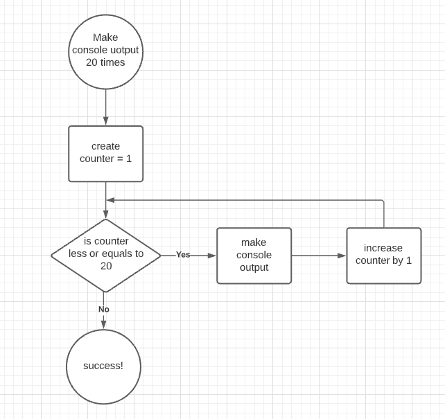
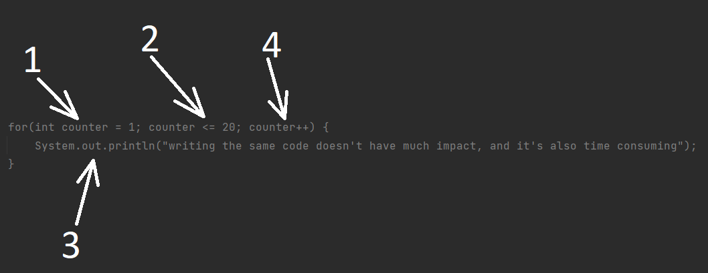

#Introduction
Before diving into "loops", make the console output with the words: "writing the same code doesn't have much impact, and
it's also time-consuming" for 20 times.

###Place for task
***next page***

###Plain task solution
You must have got something like this:

    System.out.println("writing the same code doesn't have much impact, and it's also time consuming");
    System.out.println("writing the same code doesn't have much impact, and it's also time consuming");
    System.out.println("writing the same code doesn't have much impact, and it's also time consuming");
    System.out.println("writing the same code doesn't have much impact, and it's also time consuming");
    System.out.println("writing the same code doesn't have much impact, and it's also time consuming");
    System.out.println("writing the same code doesn't have much impact, and it's also time consuming");
    System.out.println("writing the same code doesn't have much impact, and it's also time consuming");
    System.out.println("writing the same code doesn't have much impact, and it's also time consuming");
    System.out.println("writing the same code doesn't have much impact, and it's also time consuming");
    System.out.println("writing the same code doesn't have much impact, and it's also time consuming");
    System.out.println("writing the same code doesn't have much impact, and it's also time consuming");
    System.out.println("writing the same code doesn't have much impact, and it's also time consuming");
    System.out.println("writing the same code doesn't have much impact, and it's also time consuming");
    System.out.println("writing the same code doesn't have much impact, and it's also time consuming");
    System.out.println("writing the same code doesn't have much impact, and it's also time consuming");
    System.out.println("writing the same code doesn't have much impact, and it's also time consuming");
    System.out.println("writing the same code doesn't have much impact, and it's also time consuming");
    System.out.println("writing the same code doesn't have much impact, and it's also time consuming");
    System.out.println("writing the same code doesn't have much impact, and it's also time consuming");
    System.out.println("writing the same code doesn't have much impact, and it's also time consuming");
    System.out.println("writing the same code doesn't have much impact, and it's also time consuming");

There's something wrong with that code, isn't it? Imagine that you were to make this action not for 20 times, but
for a hundred, a thousand... a million. That would take eternity to do that with almost no impact, and what is more 
that code will become unreadable. As you must have already mentioned the whole point of this code is just REPEATING 
THE SAME block of code over and over again.  

# The most basic loops

###While

As you can see the whole point of this example above is just REPEATING THE SAME block of code over and over again no
matter how many times we repeat that. For cases when we have to repeat certain action several times in all c-like 
languages there's a loop construction, which provides a developer with an ability to extract repeatable action to some 
block and declare amount of times for that action to be executed. The following diagram illustrates  the algorithm: 

The main idea of that algorithm is to make console output for 20 times, and to do so as you can see we need to declare
the variable through which we will be able to have overall control over the loop itself, which is (in our case):
- int counter = 1, this variable is necessary to know how many times we have already gone through the loop.
- is counter less or equal to 20, at this point we are checking the amount of times that we have already gone through
    the loop, and there are after that checking 2 possible options:
- - counter is less or equals to 20, which means that we need to execute the code, which basically is:
- - -  make console output, the code itself
- - -  increase counter by 1, which means that actual iteration of code execution is over
- - counter is more than 20 which means that we shouldn't do anything else as we have reached the amount of necessary 
    repetitions

There are 3 (actually 4 but in the fourth one we will get acquainted in the future modules) main type of loop 
constructions:"while", "for", "do-while". We will begin with the "while" loop, and the task with console output becomes:

    int counter = 1
    while(counter <= 20) {
        System.out.println("writing the same code doesn't have much impact, and it's also time consuming");
        counter++;
    }

And that is all! This seems to be much better and much more laconic, isn't it? Let's take a look under the hood:
1) Just like in th block scheme we define the counter.
2) Condition checking. The keyword "while", which literally says: until the counter is less than 20 do the following:
3) Make the console output:System.out.println("writing the same code doesn't have much impact, and it's also time consuming");.
3.1) Increase the counter by one.
4) AND as the condition checking in the 2nd step was true(the counter is still less than 20), and we got to this block 
of code, we have to return to the 2nd step to check the condition once again, and it goes on until we reach 21 with our 
counter.

After taking a look at "while" loop, this task becomes much less time-consuming, and also we almost don't have 
limitations on the amount of repetitions, which can save much time for us.

***
###For

"while" loop looks much better than just copy-pasting the same code line/s required amount of times(and you are less likely
to make mistakes), but in this case we had to take some additional space to **define**, **check** and **increase** the
variable that will give us the control, there's a way to make this even shorter, which is basically "for" loop, which
looks like this:

    for(int counter = 1; counter <= 20; counter++) {
        System.out.println("writing the same code doesn't have much impact, and it's also time consuming");
    }

The code has become even shorter, as we have extracted all the code that is responsible to control the "loop" flow into 
one block(or even one line), but the principle is still the same:

1) Define the counter(just like before).
2) Go to the following statement, which is checking the condition.
3) Execute the code block is condition is true.
4) Increase the variable counter.
5) execute the 2 step and so on until false is met. 

Tricky point here is that if the condition is true it appears to be logical to increment the counter and only after that
go to the code block execution, but it doesn't work like this, as the increment (counter++) statement is executed only 
after the code block with the logics itself is finished.
