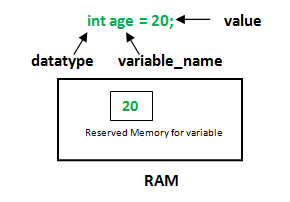
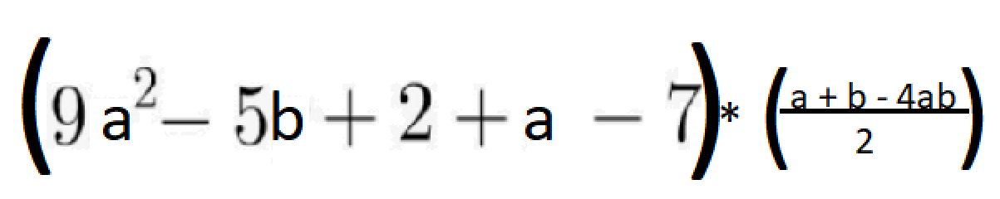

# Introduction

Each communicative language has list of its own rules and laws that are used for standardizing those communications and,
as all of us know, this is called syntax. This is used to create well-formed, meaningful and understandable communication
units - sentences. The main idea of communication is information exchange.

Programming languages have the same purpose - it's the tool for information exchange between human and a computer. 
Just the same as in spoken languages, programming languages have their own syntax. Whereas syntax 
itself is a set of rules that define certain combination, order and structure of programming language. They are required
so as to make it possible for computer to "read", understand and execute written in human language code. In other words 
it's a bridge between mache commands and human communication, it is used for "explaining" what a programmer wants to get 
from a machine. It's the way of creating commands for the computer to execute. 

The main difference between spoken and programming syntax: humans can understand the sentence even if 
there are mistakes, but computers do not accept syntax mistakes, and they refuse to work!(not all languages, but we do 
not consider them). This is the reason why knowing and understanding programming syntax is one of the first steps on
programming road. 

----------------------------------------------------------------------------------------------------------------

#Java syntax
Each programming language has its own rules of writing code, so java does too. 

The first 2 statements are familiar to you as they were previously discussed. In short, these are the lines for: telling 
under which folder the program is and what external code must be used within our program. 

The next meaning part is **_public class First_**. This is the class declaration. There's no currently need for deep 
understanding of what a class is (you will get acquainted with that later throughout this course, and we will take a 
look at each word that is used in this example later throughout the course, so no worries), for now it's enough 
to know that this is a "wrapper" for our programs, as java cannot run its programs outside class. 

The following part is **_public static void main(String[] args)_** this is the entering point of our program, just like
buildings have front doors for entering them, our programs must begin from some certain point, and for java it's *main*
method declaration. Java has constructions that are called *method*s, which are created and used in terms of *class*.
This method must always be called as main, as java looks for any method in program, which is public static void 
main(String[] args), and if only it finds it -> program starts running. There's no need for knowing how it works 
(for now) as this will be described in further chapters. In short those are the containers for program logics,
which consist of lists of actions to be performed. 

The following meaning point is *System.out.println("This is my first Java program");* this is the part where the program 
logics is kept, the line is called an expression, it's a command/set of commands that will be read and performed by JVM.
Every expression ends with semicolon, this symbol simply means the end of statement, just like written
languages have dots at the end of the sentence, programming languages use semicolons for the same purposes. 
It's the representation of any expression ending. And the whole line (ending with semicolon) is an action to be performed
by Java. This particular line is responsible for writing the text on the console.

Purpose of curly brakes is gonna be uncovered later in this chapter.

In this module we have got acquainted with key points in java syntax,and also we've seen a program example.

Tasks:
1) Fill in the gaps to make an application write data to console: fill the gaps to print "Fixed" to console with a new line.
Use code snippet provided here:

     
    public class FillGapsApp {
        public static void main(String[] args) {
                  .           ("Fixed");
        }
    }

2) make console output like: "java" + \n "is" + \n +"smth". Create java program that will write to console:
java
is
smth
For that use the following code snippet:

    public class PrintWordsApp {
        public static void main(String[] args) {
            //write your code here
        }
    }

3) create main method and make console output:"This is my first Java program". Create java program that will write to 
console:
This is my first Java program
For that use the following code snippet:

    public class PrintSentenceApp {
    }

4) given piece of code:(not compiling one), fill everything that is missing for the program and compile and build it.
Do that inside of a code snippet here:

    public class BrokenApp {
        public main(String args) {
            System.out,println("fixMe)
        }
    }

5) update this class to make an output: "I'm updated." + \n "can be compiled. And can write to console"
The code to be updated is inside of a code snippet:

    public class UpdatedApp {
        public static void main(String[] args) {
            System.out.println("fixMe");
        }
    }

#Java key points

###Identifiers

Each and every person has a name, it's used for identifying a specific human. People use the "naming" concept for simplifying
process of describing the object they are communicating about. It's hardly imaginable to live in a world without names,
as it would take hours for describing the subjects of any speech.

In programming languages the same technique is also used. The names here are called **_identifiers_**. They are applied
for: classes, fields, variables, methods, arguments etc. In other words anywhere where we need to identify one 
construction from another, identifiers are used. As in example in previous chapter, you've seen **_main_** method. 

Here the most significant point for now is **main** word. This is the _method name_ or identifier. If you create another 
method and call it speak, that will be something like this:

    public static void speak() {
    }

Identifier in this case will be **speak**. And just the same as in real world people are associated with their names, java
constructions are associated with identifiers. Those named pieces of code can be called to execute their job where 
necessary. You will get acquainted with the process of calling the code a bit later.

**PAY ATTENTION**
Java has certain conventions regarding how to call a variable:
https://www.javatpoint.com/java-naming-conventions - here you can find information about naming conventions in java.

###Keywords

Identifiers are tightly tied with _keywords_. Those are special words that are reserved by java for its needs. They 
are used all over any program and have special meaning for java, and this is the reason why they are reserved. There are
about 50 reserved keywords in java, and you have already seen some of them:**class**, **public**, **void** etc. Cool 
point here is that there's no need in memorizing all of them at once, as you will learn them, when necessary. Keywords
are usually used for creating some constructions, which should be identified, like classes, methods etc. This is the
reason why java expects to see identifier after certain combination of keywords.

Those words cannot be used for names of literals, variables, classes, methods etc. the main reason for that is that java
looks for such words to understand what a programmer wants, it's a tool for creating commands for java to perform.

Tasks:
1) make the program work (var starts with 1, $, % etc);
Update given code so as to be able to compile it:

    public class JavaVariableNames {
        public static void main(String[] args) {
            int 2morrow = 0;
            int $money = 10;
            int %hundred = 100;
            int !back = 1000;
            int _underscore = 10000;
            int #sharp = 100000;
            int *star = 1000000;
            int BADEXAMPLEOFVARNAME = 1000000;
        }
    }

2) make the program work (vars have the same names);
   Update given code so as to be able to compile it:

    public class CopiedNames {
        public static void main(String[] args) {
            int variable = 0;
            int variable = 2000;
            int value = 1000;
            int variable = 4000;
            int value2 = 3000;
            int variables = 5000;
            variables = 7000;
            int value = 90000;
            int int = 100000;
            int my integer = 1000000;
            int my+var = 1234567;
            int my__-__integer = 1234567;
        }
    }

3) make the program correspond to java code conventions(snake case to camel case, 1st capital letter of a var name,
   java keyword as an identif., crappy name (not corresponsive name, 1 char name)).
   Update given code so that it is corresponding to java name conventions, following the case of variables (if the 
variable in example is in snake case this should be followed):

    public class NamingConvention {
        public static void main(String[] args) {
             int _variable = 10;
             int variable_One = 1;
             int variableTwo = 2;
             int variable_three = 3;
             int VARIABLEFOUR = 4;
             int VARIABLEfIVE = 5;
             int VariableSix = 6;
             int variableseven = 7;
             int VariableEight = 8;
        }
    }

4) (After advanced reading about java naming conventions )In the given code snippet make the program correspond to java
code conventions*(method, class, field names...):

    public class advancedNamingConvention {
        private static final int adult_age = 18;
    
        private int AGE;
        private int phoneNumber;
    
        void CAllToFriend() {
            //some code
        }
    
        void callByNumber(int Number) {
            //some code
        }
    }

#Java variables

As mentioned above identifiers are sort of names for something. They are used, to associate a certain name with language 
construction, for example with a **_variable_**. Variable is a name(identifier) that is associated with a certain value
of certain type.

    int t = 10;

The construction above is variable declaration and assignment. Where the declaration is the process of telling java that
variable of this type will be created, and assignment is associating the value with that variable.  Sometimes those 
processes can come separately:

    int t;
    t = 10;

On the first line we told java to create a container for int type, and only after that we put there the value.
The construction above consists of: identifier here is "t", the value is 10, and "int" is a type, which 
represents integer value. So everything must be saved somewhere, mustn't it? Variables in java are saved in computer
memory. The left-hand side of a variable declaration says:"allocate memory that is enough for saving int value(so-called 
container) and associate identifier _t_ with that container, and put 10 there". This is actually what is happening when 
someone declares a variable. And as it was mentioned, memory is allocated not for the value, but for the container for that.
This is done so as to be able to reuse that container in future.  

It's just like creating a box that is big enough to store the laptop. And the identifier here is associated with that box,
not with the laptop. Such approach provides us with an opportunity to take this box later and get the value from it. 
Working not with the box instead of the value itself is useful, because otherwise each time we would need to reuse some 
value, we would need to create a new variable that would contain only certain value. 

The process of variable creation is called _declaration_. Variables are declared in the following way:

    data_type variable_name = value;

Where the data_type is the type of container(amount of memory) to be allocated.
Variable_name is the identifier.
Value - to be put in the container. Or in other words **literal**.
They are called variables (not constants) as their value can be changed:

    int t = 10;
    t = 0;

Important thing here is that when we reuse the variable we do not set its type, as it was already announced. We just 
reassign the new value for the old container, which is addressed with its name "t" in this case. There are some rules 
for variables naming in java:
1) Variables naming cannot contain white spaces, for example: int num ber = 100; is invalid because the variable name
   has space in it.
2) Variable name can begin with special characters such as $ and _
3) As per the java coding standards the variable name should begin with a lower case letter, for example int number;
   For lengthy variables names that has more than one words do it like this: int smallNumber; int bigNumber;
   (start the following word with capital letter).
4) Variable names are case sensitive in Java, which means that number and nUmber - are different variables.

####Literals
Before diving into numeric primitives theory it's good to take a look at the "literal" definition. So literals are simply
the values that are associated with the identifiers that are given to them:

    int t = 1;

So here the literal is **1** and it's of an integer type, identifier here is _t_. So essentially, literals are the values
that are stored in variables.

Tasks: 

//-1) Create 4 variables, call them fist second third 

1) Basic variable initialization. Create 3 int variables with names: first, second, third. Initialize them with 
values: 1, 10, 100. Make console outputs for all of them, each on new line. Implement the program
inside of given code snippet: 

    public class BasicVariablesInitialization {
        public static void main(String[] args) {
             //write code here
        }
    }

2) One-line variable declaration and initialization.  Declare 3 int variables within one statement and call them a, b, c(order must be followed). Initialize them in one 
statement with value "10". Print to console "c". Implement the program inside of given code snippet:

    public class DeclaringVars {
       public static void main(String[] args) {
            //write code here 
       }
    }

3) Reassigning references. Declare another 3 variables: first, second, third(1,10,100). Make console output of 3 
initial vars(first, second, third) each on new line. Initialize vars  linkToFirst, linkToSecond, linkToThird with the 
variables first, second, third. Reassign (first, second, third) with the : 15, 6, 4. And write to console all the 
variables(in the order they were declared), each on new line. Pay attention to results. 
Implement the program inside of given code snippet:

    public class ReassigningValues {
       public static void main(String[] args) {
            //write code here 
       }
    }

##Java primitives

As was mentioned above each variable is a container for some values. They store data just like boxes in real life store 
things. Each box in real life has its parameters, like: size, color, etc. In programming languages those boxes have 2
main characteristics, that we are interested in:
1) data type - type of value that can be saved in container.
2) size of container - each data type in java requires some space for its needs.

For simplicity imagine that we can have 2 containers: 
1) for food 

2) for cargo transportation

Even though they are both called as "containers" they serve completely different tasks. The same in java, each data_type
can store the values of that type. And just like in the real world those data types have certain amount of memory that is
allocated for storing values. Data types that are predefined by java for the most basic operations are called - 
primitives. Java has 8 primitive data types namely byte, short, int, long, float, double, char and boolean. Sometimes 
this set of data types is not enough in programming, so java provides you with an opportunity to create your own type, 
the way of doing that will be introduced later in the future. 

##"_Numeric_" primitives

In real world we have some classes of numbers: natural, real, rational, irrational, etc. So in programming 
languages classes of numbers also exist, but they are grouped in a little different way:
1. for integer numbers there are 4 types: byte, short, int, long.
2. for decimal numbers: float and double.

These are 2 main groups for serving numbers in java. It seems a bit confusing as java has 4 types for serving integer 
values, there's a reason for that: each type as you remember has its size, and those types differ on size:

//update the table, set minimum & maximum in numbers

*Image taken from https://www.baeldung.com/java-primitives*

The difference between those types is not only in the size, but as you must have already mentioned from table above, also
in capacity of values that can be stored in it. Those different capabilities mean that you should always think about the 
integer value that you are going to use across the program. For some cases using bytes(which contain values from -128 to
    127) is more than enough: if the task is to save the amount of floors in a building - bytes are perfect. This is done 
so as to be able to allocate only necessary amount of memory for the variable. There's no doubt that, from language 
perspective you can always use **long** type for integer numbers, but if you need to store number that in not gonna take 
huge values(amount of days in a year, etc.) the best option would be to use something suitable: an average yer contains 365 
days, which is bigger that a byte can contain => using short here is the best option. But why? Why is it a bad idea 
to use say integer or a long for that? So the answer is simple, consider the following example: you need to store a laptop,
and you have several options for that: a bag, a wallet and a barge. What is the best option here? There's no doubt that
a bag here is the best solution, because if ypu use for each laptop a barge, you will simply run out of space! Just like 
in real life, programs have limited resources to use, this is why you should always think what you are going to create, 
store and use. Essentially, even though programs nowadays are running in environments where it's hard to run out of 
memory, still using the most suitable container for the value is a mandatory rule. 

So if you  want to see the reason why numbers depend on size, and how size is related to min & max values, you can take
a look at an advanced chapter:

##########pure theory

-------------------------------

####Explanation why integer types have different size

As it was mentioned above each type in java has its size. The smallest size value for any programming language is a bit.
Bit is a binary digit. It's the smallest unit in computer memory that can have 2 states: 0 and 1(this is why it is called
binary). So that simply means that everything in computer is just a combination of zeros and ones. But frankly speaking,
when someone wants to work with huge amount of data, like with videos or video games etc. nobody uses bites to determine
size of something, you are more likely to work with mega/giga/tera - bytes. So we use bytes (with different prefixes) to
describe amount of memory that is required for something.

And as you can see from picture above each byte consists of 8 bites. As this kind of storing data in computer memory is
the most widely spread, it is used in programming. Another important thing here to mention is that this representation of
storage is just a binary numeric system, using which we can easily determine maximum and minimum value for each data type.  
The smallest numeric data type in java is  _byte_, which means that it contains 8 bits:

    0 0 0 0 0 0 0 0//eight zeroes is minimum value, which equals to "0" in decimal system

The example above demonstrates minimal value for a byte. Respectively you may think that max value for a byte will be:

    1 1 1 1 1 1 1 1 

Which is true for binary number, which consists of 8 figures and equals to 2^8 = 255. But java has a bit different logics:
programmers are also interested in working with negative numbers, and the decision is as simple as:

Java is using 1 figure for storing negative/positive sign. If the last bit is 0 -> value is positive, otherwise it's
negative. This all leads us to the point where maximum value is actually (2^7) - 1 = 127:

    0 1 1 1 1 1 1 1 //2^7 - 1 = 127

//If you want to know how to convert binary to decimal, you can surf the internet to find the answer.  
As it is mentioned above maximum value here is 127, whereas the minimum one is -128. Byte range is from -128 up to 127.
Each data type has its size in bytes, which leads us to the point of determining maximum and minimum values for them:

1) Byte: from -2^7 to 2^7 -1
2) Short: from -2^15 to 2^15 -1
3) Int: from -2^31 to 2^31 -1
4) Long: from -2^63 to 2^63 -1

Double and float have a bit different way of managing the data. It will be described in advanced chapters.

-- PURE THEORY

------------------------------

###Byte(task with declaring reassigning, wrong type assigment, delayed assigment, wrong reassigment)

Let's find out how to create a **byte** variable:

    public class Main {
       public static void main(String[] args) {
           byte b = 1b;
       }
    }

As you remember the first 2 statements are used by java, so for now, we do nat pay attention to them.

The line that we are interested in is: **byte b = 1;** so this is just a simple variable creation:
1. the first thing is type definition, the place where we tell java what container should be used.
2. identifier - the name to be associated with the value.
3. literal - the value to be stored in the container.
4. assignment - process of putting the value to container(setting the literal value to a byte container).

This is an example of **byte** variable creation. Essentially, variable of any type is created in java this way.  Just 
like any other variable, byte is a primitive type. It can only hold integer values from -128 to 127. And as it's clear 
from its name, it requires 1 byte of free space for managing those values.

###Short
The next primitive type that we are gonna to take a look at is **short**, it's a bit bigger than a byte(actually it 
consists of 2 bytes of memory (8 bits)):

    short s = 500;

As you can see from an example above it's the type for integer values, it differs from byte by the values that it can 
hold: as requires twice more free space than a byte (16 bits) it can hold much bigger values - from -32_768 to 32_767.

###Int
If we need to serve even bigger numbers than those, java provides us with **int** type, which consists of 4 bytes 
(32 bits) and holds values from -2_147_483_648 to 2_147_483_647:

    int i = 2_000_000_000;

By the way this is the most commonly used integer type of all, as it covers the majority of use cases in programs.

###Long
**Long** is the biggest type for holding integer values, it requires 8 bytes of free space(64 bits) and correspondingly,
can serve values from -9_223_372_036_854_775_808 to 9_223_372_036_854_775_807:

    long l1 = 100L;
    long l2 = 100_000_000_000;

The only difference here in type declaration is that when a value is smaller than the biggest integer value you (or 
less than the smallest) you should clarify that this should be a long value adding to literal value symbol "L". This is 
required because default value type in java for integer literals is int, and if you want to allocate more memory, than 
you have to explicitly tell java that this is gonna be for long, otherwise you will see the error.

###Decimal numbers
Sometimes operating with just integer numbers is far not enough: if we need to calculate time of a sprint runner, measure 
temperature, to express currency etc. for such cases integer numbers are not enough. This is where decimal numbers come
into play. There are 2 primitive types for decimal numbers: float and double.
Even though they both aim to express decimal values, they have 2 main differences: they differ on percussion and values 
that they can contain:

As you can see from the table above double is more precise, and can handle a bigger variety of values, but the situation 
here is the same as with long values, the bigger and the more precise value the type can store the more memory it consumes.

###Float
As you have already seen from picture above decimal types are represented within float and double types. Float consists 
of 4 bytes, is able to manage 7 number of precision and stores values from ~ -3.4 * 10^38 to +3.4 * 10^38. 

    float f = 0.01f;

Pay attention to "f" symbol here, it's used for the same purposes as "L" for long type: to explicitly tell java that the
type of literal is float, as the default one is double.

###Double
This is the other primitive type that is used in java for storing decimal numbers. This type is more precise: the 
precision is 15 symbols. Also, it can manage numbers from ~ -1.8 * 10^308 to 1.8 * 10^308.

    double d = 123245.1234567890;

This type requires at least 8 bytes of free memory to be created.

If you want to know the reason why those values are not precise check chapter for advanced reading
####**Advanced**
//describe percussion, why floats suck for money **advanced**
//and accurate calculations(maybe in advanced reading)

------------------------------------------------------------

###Boolean
Sometimes we need only two options to describe the state of something: if the light is on or off? For those cases, java 
has **_boolean_** primitive type, that can contain only 2 values: _true_ or _false_. By the way these 2 words are 
reserved by java. 

    boolean b = true;

the size of boolean type is not precisely defined as it represents only 1 bit of data.

###Char
Char - is a primitive type for symbol representation. It acquires 2 bytes of memory and is able to handle characters from
UTF-16.

    char c = 'v';

Special point here is that _char_ type needs those single quotes for telling java that this is literal, that needs to be 
treated as symbol. The way java manages those symbols is the following: it associates value of symbol with unsigned short
value. So the following is gonna be the same:

    char t = 't';
    char t1 = 116;

Besides, char is able to handle also ASCII, and it has special combination of symbols:

    char myChar = '\u0054';

Tasks:
1) Types setting. Complete the code snippet below with corresponding types. Each var type should consume as less
 as possible e.g.: 2345 - suits to short. Code snippet:

        public class SettingTypes {
            public static void main(String[] args) {
                 first = 10_000_000_000L;
                 second = 'a';
                 third = 5 > 9;
                 forth = 12.90434323324342;
                 fifth = 12.3F;
                 sixth = 1;
                 seventh = 129;
            }
        }

2) Int representation. Print chars :'c', 'h', 'a', 'r' using int representation. Implement program in the following code
snippet:

        public class IntRepresentation {
            public static void main(String[] args) {
            }
        }

3) Formula. Declare all necessary variables and write down the formula using corresponding names
 (declare those vars before the formula):

Implement program using the following code snippet:

   
    public class FormulaCreator {
        public static void main(String[] args) {
        }
    }

##Operators
Any program aims to solve some task, and usually the tasks are aimed to perform some actions on the data that we have:
calculating sum of anything, etc. For that purposes java has list of operators that can be divided into groups:
1. Arithmetic Operators.
2. Unary Operators.
3. Relational Operators.
4. Assignment Operators.
5. Bitwise Operator*.
6. Logical Operator*.
7. Ternary Operator*.
8. Shift Operator.*

*- These operators will be introduced later throughout the course

Arithmetic operators are the ones that can be met in math:+, -, *, /, %(modulo), ^(power operator).

####Unary operators
Usually operators perform calculations over variables or in other words _operands_. And if an operator interacts with 2 
operands -> they are called binary operators(e.g. math operators). Meanwhile, _unary_ operators need only 1 variable to 
work with:

    int t = 10;
    t++;

If you try to print that value you will see 11 as an output, it's all because it's the equivalent to:

    int t = 10;
    t = t + 1;

So it takes previous value and increases it by 1. It's POST INCREMENT. Here is the list of unary operators:

    int t = 11;
    t++;
    ++t;
    t--;
    --t;

The first two and the last two seem to be pretty similar, but they are different in operations order:

    int t = 10;
    int b = 10;
    int v = t++;
    int n = ++b;
    System.out.println("v = " + v + ", n = " + n + ");
    // v = 10, n = 11

In this case int b is PRE INCREMENTED, which means that variable b will be increased before it is assigned to n. 
Meanwhile, t is POST INCREMENTED which means that value from "t" it will be assigned to "v" and only after that t will be 
increased. The same is with decrement: post decrement would assign the value to new variable and then decrease initial
one, when pre decrement decreases the value of original var and only afterwards performs assignment to the new variable.

####Short forms of assignment operators
Sometimes if we want to calculate sum of anything we need to take old value and add to it a new one so as to get sum.
Usually it consists of the following actions:

    //calculate sum of 98, 156, 343
    int sum = 0;
    sum = sum + 98;  
    sum = sum + 156;  
    sum = sum + 343; 

As you can see the actions above are really similar with increment operator, with the only difference: we can add any
number. And java has a _short form_ for such cases:

    int sum = 0;
    sum += 98;
    sum += 156;
    sum += 343;

Which is the same as the example above. These short forms exist for all of arithmetical operators:-=,+=,*=,/=,%=.

###Relational variables
If we need to compare 2 values in math we do that with relational signs: >, <, <=(less or equals), >=(more or eq), 
=(equals). So, those math signs has correlation in java, all above but equals sign(in java equals operator is **==**) are
the same, and the result of those operators is not a number, but a boolean value:

    boolean b = 4 > 6;
    System.out.println("statement 4 > 6 is " + b);
    //statement 4 > 6 is false

The result of expression is boolean, as we expect to get from those operators some kind of comparison result which, in 
the end, is used to see if it's true or not. 

There are 2 operators which look different from math signs: equals operator(==) and not equals (!=). The reason why 
equals in java consists of 2 equal signs is because a single one in java is an **assignment operator**, which, as you've
already seen is used to associate literal with identifier.

Tasks:
1) Converter. Implement a program that will convert minutes to seconds and print it console. Implement program in the
code snippet below:

    public class TimeConvertor {
        public void convert(float minutes) {
        }
    }

where minutes - variable to be converted.

3) Create 3 int variables with names: first, second, third. Initialize them with values = 1, 10, 100. Print all of them
      to console within one System.out.println statement(with no spaces between). Implement program in scope of the 
      following code snippet:
    
   
        public class ThreeStuckVars {
           public static void main(String[] args) {
           }
        }

4) Broken calculator. Create a program that will perform simple division of numbers, you will be given a number and 
your task will be to create a program that number by 5 and print correct result:

    public class NumberDivider {
        void divide(int toBeDivided) {
        }
    }

where toBeDivided - variable to be divided.

###**Advanced operators**

------------------------------------------------------------

###Type casting
Sometimes we want to convert the value of one type into another type, and this process is called ***casting*** in java.
There are 2 types of casting:

- Widening Casting (automatically) - converting a smaller type to a larger type size 
- - byte -> short -> char -> int -> long -> float -> double

    int myInt = 9;
    double myDouble = myInt; // Automatic casting: int to double

    System.out.println(myInt);      // Outputs 9
    System.out.println(myDouble);   // Outputs 9.0

Widening is done automatically because casting happens from a smaller type, and the container that value is transferred
to is able to handle any value from a smaller one.

- Narrowing Casting (manually) - converting a larger type to a smaller size type
- - double -> float -> long -> int -> char -> short -> byte

Narrowing is a bit more complicated:

    double myDouble = 9.78d;
    int myInt = (int) myDouble; // Manual casting: double to int

    System.out.println(myDouble);   // Outputs 9.78
    System.out.println(myInt);      // Outputs 9

When we are trying to convert the value from the bigger type, java is aware that this value can be bigger than max value
from converted type -> it makes programmer to do conversion explicitly:
   
    double myDouble = 9.78d;
    int myInt = (int) myDouble;

###Operators and types
As it was mentioned above java has several numbers of data types, and operators aim to work with them. So dependent on the
type, the same operator can perform different actions: plus operator(+) can be used with numbers and with strings.
Strings haven't been considered yet, but as a short overview those are representation of combination of characters in java:

    String s = "any text";

Special point here is that strings require presence of double quotes:"". And "+" can be used with strings to append them.

    String any = "any "
    String text = "text";
    String result = any + text;
    System.out.println(result);
    //any text

the example above aims to illustrate, that operators depend on the type they are used with. Essentially, that means that 
java changes operator behaviour dependent on the type it's used with, those differences are called operator 
**_overloading_**. In the example above "+" sign, which is usually expected to perform addition of numbers, in this case 
performs "_**concatenation**_" - the operation that appends one string to the end of the first one. 

Another thing to mention here is that when operation is performed over variables of different type (byte and double) -> 
the smallest is implicitly casted to the bigger one:

    byte b = 9;
    double d = 8.5;
    System.out.println(b + d);
    //17.5

This implicit casting occurs, because java needs to know the type of resulting value. the question here is what type to 
choose from? The most suitable answer here is the biggest type out of all. This is done because double in this particular
case is more likely to be able to handle the resulting value. 

Another reason why this is done is because operators in java work only with the values of the type. And, as you can see,
if one type is bigger than the other one => operator for bigger values is applied. Essentially, that means that java has 
several versions of the same operators (e.g. "+"): for int, long, float, double and String. There are no math operators in
java for bytes and shorts as those operations are casted to int.

###Operator precedence
Just like in math java has priorities for operators. If you put circle brackets to subtraction it will be executed 
earlier than multiplication:

    int result = (2 - 1) * 10;//10 
    int result2 = 2 - 1 * 10; //-8

But this is not only applied for math operators:

Some operators haven't been present yet, so no worries, they will be explained in the next chapters. This basically 
means that you need to know the execution precedence of operators in java, because that may impact your business logics. 
The same as if you are performing certain operations over numbers in math, some transformation and data processing is 
happening with the help of operators in java. And if you declare them in a wrong order that might impact you expected 
result and produce unexpected behaviour and bugs. The best tactics if you do not remember the priority for operator is 
to use circle brackets.

tasks:
0) Integer type casting. Create long variable(first - name) with "1000" value. Assign to the variable another var, int(second - name). Update
      the first, print both. Implement task in the given code snippet:

      public class VariableTypes {
          public static void main(String[] args) {
          }
      }

1) Float type casting. You will be given a float number, and your task will be to find a correct way to round this
 variable to integer variable, corresponding to Math rules(requires googling). Print that variable to console .Implement
  program inside of a code snippet given below:

        public class FloatTypeCasting {
            public void roundNumber(float numberToBeRounded) {
            }
        }

where float numberToBeRounded - is the variable which needs to be rounded.

2) PrePost increments. You will be given a code snippet, and you task will be to get expected result by inserting correct
 pre/post increment oprators to specified variables. Implement the task in the following code snippet:

        public static void main(String[] args) {
                int a = 5;
                int b = 7;
                int c = 12;
                int d = 15;

                // use post-increment operator in the mathematical expression
                int x =   a   + b +   c   + d;
                System.out.println("Expected c is 40, c = " + c);
                // print the updated value of a, b, c, and d
                System.out.println("The updated value of a = " + a + ", b = " + b + ", c = " + c + " and d = " + d);

            }

Expected results: x is expected to be 40, the rest but b and d to be incremented.

3) Operator precedence. Introduce changes(add brackets) to code snippets below to get expected results:

        public class OperatorPrecedence {
            public static void main(String[] args) {
                int first = 1;
                int second = 2;
                int eight = 3 + first * second;
                System.out.println(eight);//eight is expected to be 8
                boolean firstBool = false;
                boolean secondBool = false;
                boolean thirdBool = 1 == 1;
                boolean fourthBool = 4 <= 101;
                int varSix = 17;

                System.out.println(firstBool && secondBool || thirdBool && fourthBool || (varSix = 5) > 0);
                System.out.println(varSix);
            }
        }

Expected console output:
8
false
5

##FINAL MODULE TASK
1) Print false. You will be given 2 variables and your task will be to print false using those vars:

        public class PrintingFalse {
            public static void main(String[] args) {
                int first = 9;
                int second = -17;
                //write code here
            }
        }

2) Division by zero. In the given code snippet you should pick correct primitive type to allow division by zero.

    
        public class DivisionByZero {
            public static void main(String[] args) {
                _ number = 10;
                System.out.println(number/0);
            }
        }

Instead of "_" sign set correct var type

3) Positive numbers detector. Implement program that will print if number is positive true, otherwise false
(no if or ternary). Code snippet:

    public class NumbersPrinter {
        public void printIsPositive(int number) {
    
        }
    }

Where number - variable that should be used within the program.

4) Numbers reverter. Revert 3-digit number that will be passed(e.g.: given -> 489, expected -> 984). Code snippet:

        public class NumberReverter {
            public void revert(int number) {
            }
        }
Where number - variable that should be used within the program.

5) Digits sum calculator. You will be given a four-digit number your task will be to find the sum of all digits in the
given number. Code snippet:

        public class DigitsSumCalculator {
            public void calculateSum(int number) {
            }
        }

Where number - variable that should be used within the program.

6) Temperature converter. You will be given temperature in celsius and your task will be to print this temperature in 
fahrenheit(formula will be required). Code snippet:

        public class TemperatureConverter {
            public void toFahrenheit(int temperatureCelsius){
            }
        }

Where temperatureCelsius - variable that should be used within the program.
